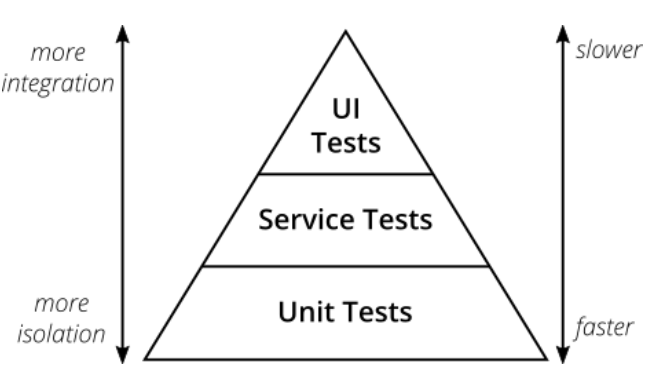
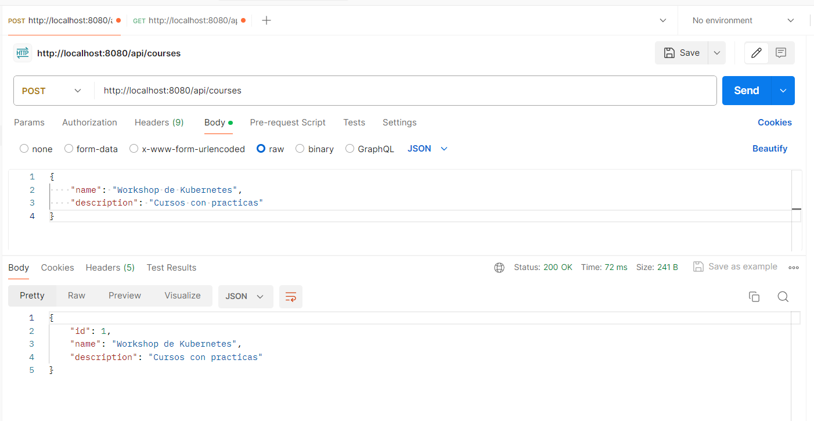
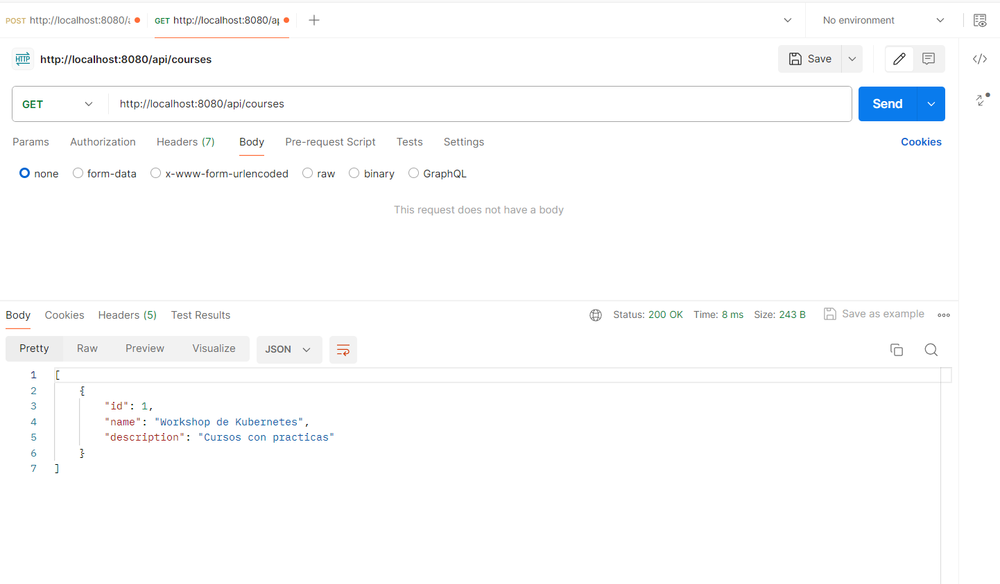
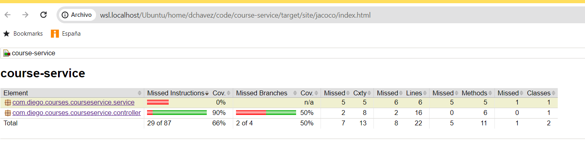
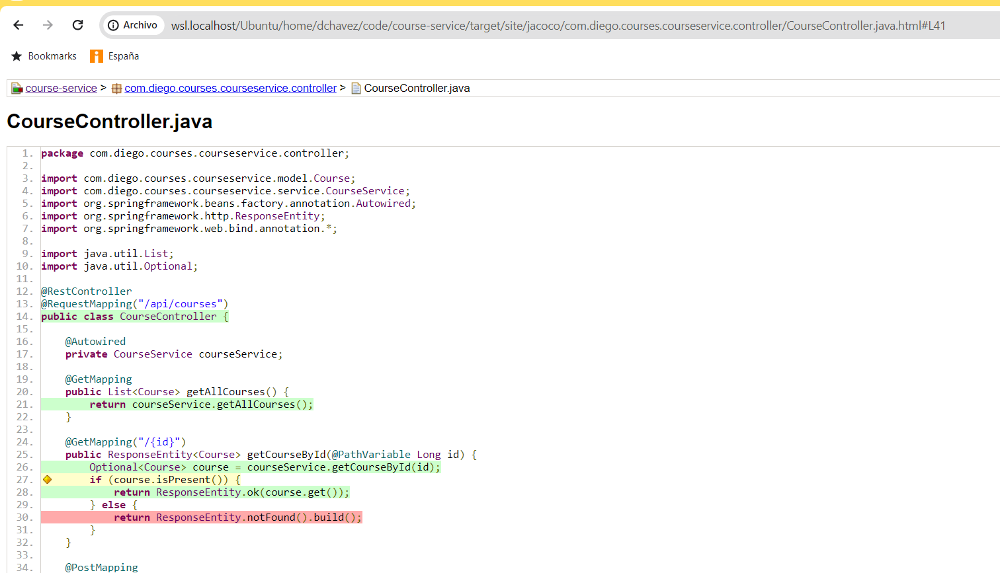
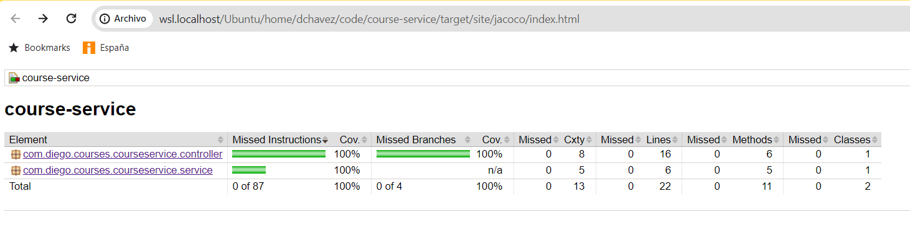
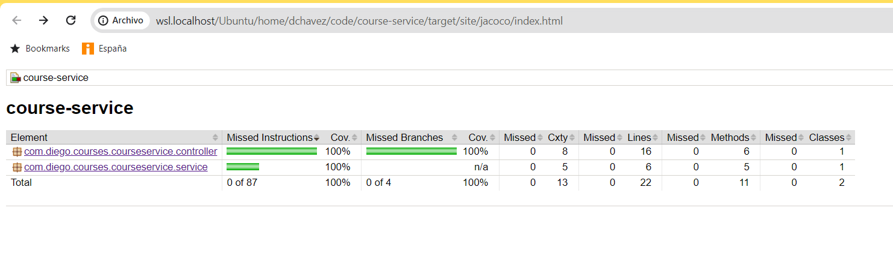
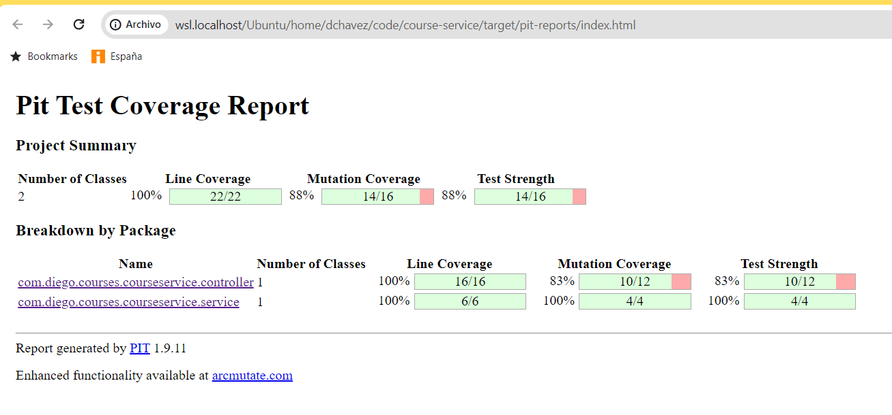
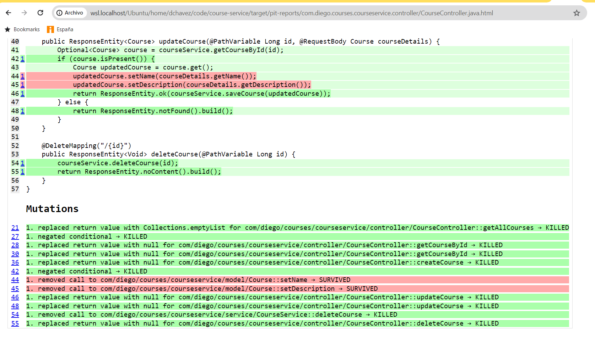
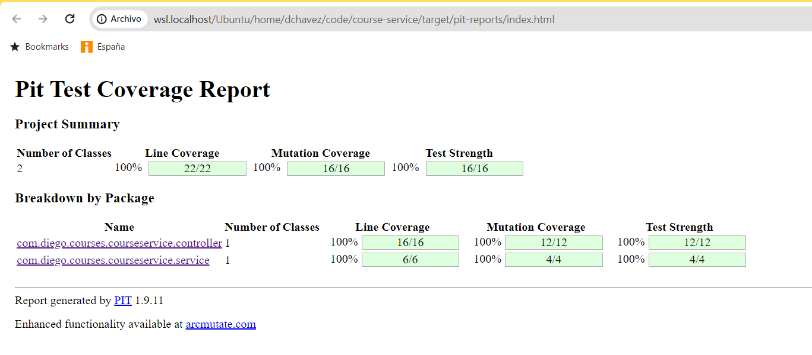

# Unit, Integration and Mutation Testing Project

## Overview

This project is a Spring Boot application that manages courses. It provides RESTful HTTP services for handling `Course` entities.

## Testing Overview

### Unit Testing

**Unit Testing** involves testing individual components of a software application in isolation to ensure they work as expected. These tests are typically written by developers and run frequently to catch bugs early in the development cycle.

**Benefits of Unit Testing:**
- Identifies issues early in the development process.
- Provides documentation for the code.
- Facilitates changes and simplifies integration.

### Integration Testing
**Integration Testing** involves testing the interactions between different components or modules of an application to ensure they work together correctly. These tests are typically more extensive than unit tests and may involve a real or simulated environment.

**Benefits of Integration Testing:**

- Validates the interaction between integrated components.
- Detects interface issues between modules.
- Provides end-to-end testing scenarios.

### End-to-End (E2E) Testing
**End-to-End (E2E)** Testing involves testing the entire application flow from start to finish to ensure that the system as a whole works as expected. These tests simulate real user scenarios and validate that the system meets the requirements.

**Benefits of E2E Testing:**

- Validates the entire application workflow.
- Ensures that the system meets business requirements.
- Detects issues that may not be found in unit or integration tests.

### The Testing Pyramid
The Testing Pyramid is a conceptual framework that highlights the different levels of testing required for a robust software application. It emphasizes having a large number of unit tests, fewer integration tests, and even fewer end-to-end tests.

**Explanation of the Testing Pyramid:**

**Unit Tests:** Form the base of the pyramid. They are fast, numerous, and provide a solid foundation by testing individual components in isolation.

**Integration Tests:** Make up the middle layer. They test the interactions between components and are fewer in number compared to unit tests.

**End-to-End Tests:** Sit at the top of the pyramid. They test the application as a whole, from the user interface to the data layer. These tests are fewer because they are slower and more complex to maintain.

## Steps for this exercice

### 1. Execute and test the app

- a. Run the App:

Get all tags, just in case.

git fetch --all --tags

Select the first one:

git checkout tags/step-1-initial-setup

And now continue:

./mvnw clean install -U

./mvnw spring-boot:run

- b. See the results with Postman:

### 2. Run the Unit Tests with Jacoco coverage

- a. Run the tests and coverage:

./mvnw clean test jacoco:report

-b. See the Jacoco Report:

Nothing about service layer, and the Controller doesn't test the NotFound:

### 3. Run the Integration Tests with Jacoco coverage

- a. Run tests with verify, where Integration tests are included and Unit don't

./mvnw clean verify jacoco:report

-b. Results of Jacoco:

Coverage 100%, including service...but it is just Integration Tests.

### 4. Improve Unit Tests

- a. Get the second step Tag:

git checkout tags/step-2-basic-functionality

- b. Run the tests and coverage:

./mvnw clean test jacoco:report

- c. See the Jacoco Report:

Now we have 100% coverage!

### 5. Execute Mutation Tests

- a. Execute mutation tests:

./mvnw org.pitest:pitest-maven:mutationCoverage

- b. Result of the Mutation:

We can try this, just by commenting the 44 and 45 lines of the CourseController, and the tests will be ok!, as if it were fine.

### 6. Improve Unit Tests

- a. Get the second step Tag:

git checkout main

- b. Run the latest step from main:

./mvnw clean test jacoco:report

- c. Execute mutation tests:

./mvnw org.pitest:pitest-maven:mutationCoverage

- d. Result of the Mutation:

